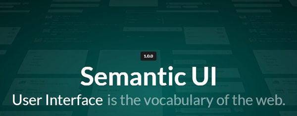

## The Dark Times Before Semantic UI ##

When I was learning HTML and CSS style sheets, I admit, that my understanding of design was very amatuerish. Black and white pages with 
little to no formatting and Times New Roman, which then evolved to simple background imagaes and basic list menus with basic color palettes. 
And I have to admit, purely designing in HTML and CSS is a chore which your end doesn't justify the means. Well, at least what I ended up 
with during my time learning the stuff. 

## Let the Frame Work ##
The beauty of programming is that we, as programmers, are surrounded by all sorts of tools at our disposal to accomplish the things we want
to do. The Semantic UI framework is one of the perfect examples of this. What makes Semantic UI so great is how simple it is to use in conjunction
with how professional the aesthetic of the framework can make a page look. With barely even a week of experience with Semantic UI, I was able to 
recreate websites belonging to various professional organizations which took no more than a couple of hours to make. Semantic UI allows even the
most inexperienced web developer to make something at the very least clean and consitent.  

## The Semantics of Semantic ##
As the name suggests, Semantic UI is a framework that utlizes the linguistic semantics of English to class HTML elements. Instead of using your own
vanilla CSS style classes to change the look of elements, you use Semantic's classes which are cleverly named to mimic how a sentence is used in english
to describe something. If you want, let's say, a big red button with a label on your page you would simply write 

class="ui big red labeled button"

in a new div element. Simple right? 

## My Honest Opinion ##

After toying around with Semantic the past week, I have to say that I really enjoy designing pages in it. For now that is. Web Development is a field of work
that I am very interested in pursuing. And from what I have expereienced, Semantic UI really is the UI framework for everyone. Which can come off as a good and a bad thing. 
For people who aren't developer per se, but need to construct a site, Semantic UI will be their main tool. Amateur developers and students will also love using Semantic
due to it being so simple, that they can worry less about looks and focus more on whats under the hood. But to the experienced developer?
Semantic UI would be a good start, but even a vast Framework such as this cannot satisfy all the needs of everyone. 
