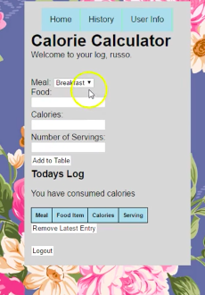

For the final project for ICS 321 at UHM, I had created a web application that utilizes a simple database to log a person's meals as well as calculating calorie consumption based on those meals. This application was stored and hosted on a C Panel server supplied by the professor at the time. 

Essentially, this program allows users to create an account which will contain all of their meal information. From there, users are able to add meals to their log, calculate the calories consumed, and even change their password if they wish. Data of the user's login information and their food log is all held on MySQL datatables contained in the C Panel application PHPMyAdmin. 

While the class was centered around databasing using MySQL, much web development skills were self taught, and, in that regard, this project was a demonstration of not only the databasing skills learned in class but the research skills that I had developed before and during the project. 

You can see a demonstration of the application [here](https://www.youtube.com/watch?v=ley4uvlTPV8).

