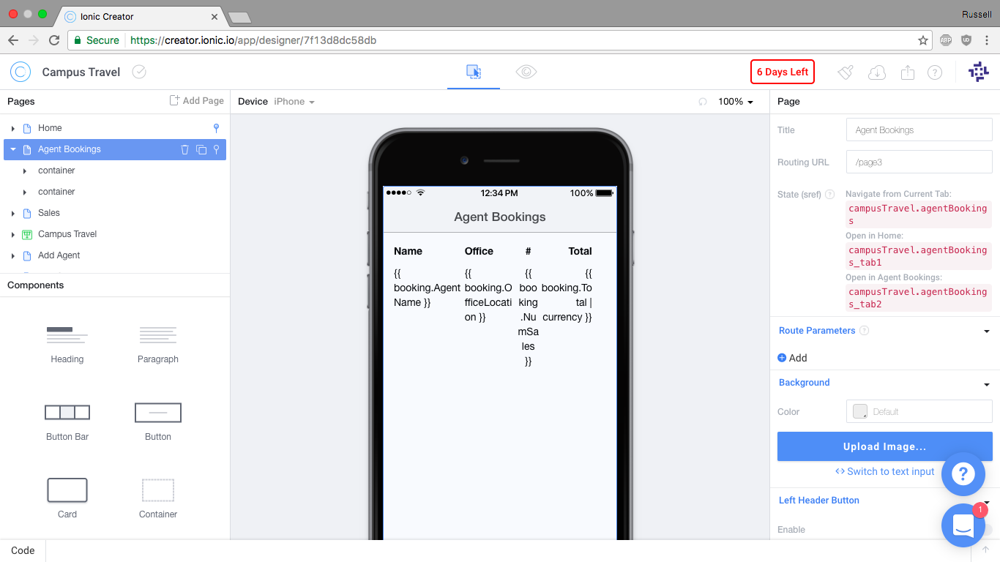

The goal of this project was to implement an application using a popular app builder, Ionic Creator. 

The application in question was a design that we have been using for most of the semester so that we could implement it in different ways. It was an application that tracked the sales of agents in a travel booking agency. All of the data for this application was kept in SQL tables.  The basic features of the application were to add new agents, the ability to add new sale data and delete sale data, and the ability to edit existing sales. 

From this project I had learned two things, the capabilities of an app builder and AngularJs. As far as the app builder goes, it is a very user friendly interface which allows even people with minimal amount of programming skills to at least make something simple. While there are programming aspect to the Ionic Creator such as writing services in JavaScript in the built in text editor, most of it is organized to where you can just "fill in the blanks", which is where the AngularJS was filled in. AngularJS is a very interesting concept, essentially an enhanced version of HTML that interfaces with the code that is written for the application. 

 
You can find the code for this project here: <a href="https://github.com/russellomo/CampusTravel"><i class="large github icon"></i>CampusTravel</a>
